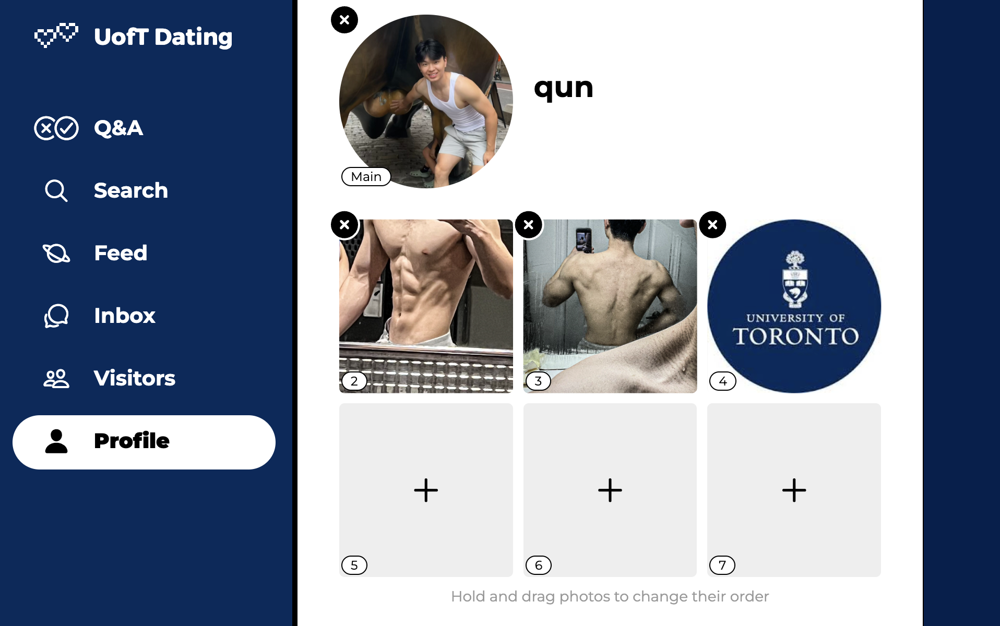
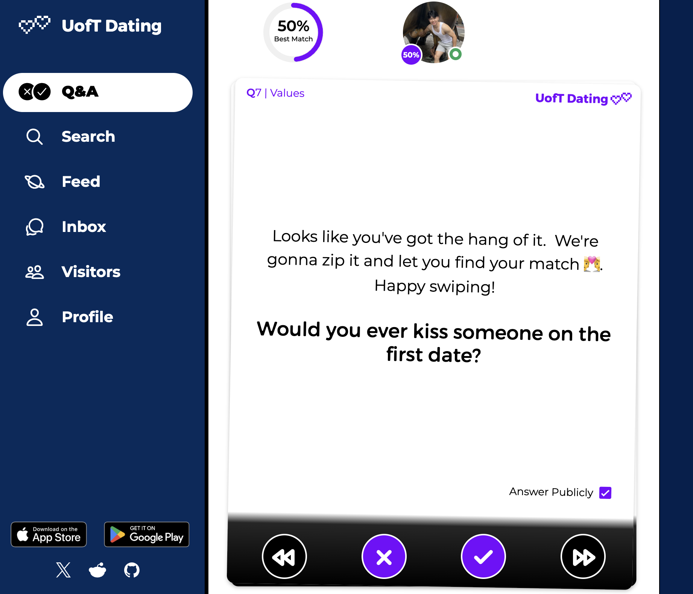
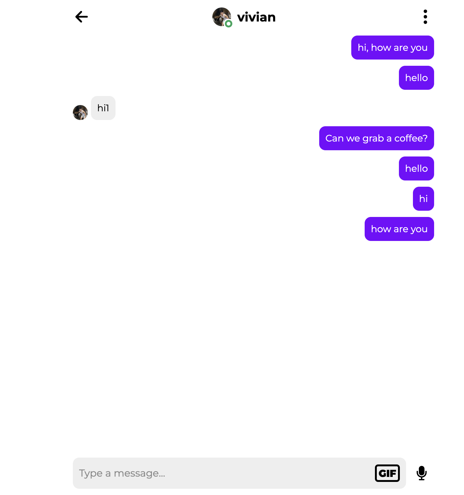
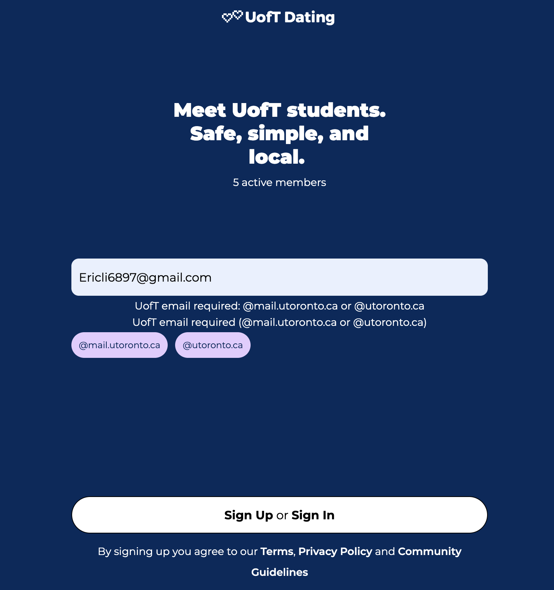

# ❤️ UofT Dating

A university-exclusive dating platform customized for the **University of Toronto**, built on top of a mature open-source social framework and re-engineered to enforce **UofT-only access**, **real-time messaging**, and **profile-driven matching**.

This project focuses on **local trust**, **identity verification**, and **meaningful connections** within the UofT student community.

---

## ✨ Project Summary (In Plain English)

**UofT Dating** is a private dating platform designed **only for University of Toronto students**.

Unlike generic dating apps, this platform strictly enforces:

- University email domain validation  
- One-Time Password (OTP) email verification  
- Profile + Q&A–driven matching  
- Real-time chat powered by WebSocket  

The goal is to create a **safe, local, and identity-verified** social environment for UofT students.

---

## 🧩 Core Features (Based on Demo Screenshots)

### 👤 Profile Customization

Users can build a rich personal profile by:

- Uploading an avatar and lifestyle photos  
- Reordering images to control first impressions  
- Presenting themselves beyond a single profile picture  

A complete profile improves **trust**, **visibility**, and **matching quality**.

---

### ❓ Q&A–Driven Matching

Instead of matching purely on appearance, users answer curated questions.

- Questions are randomly presented  
- Answers are stored and compared server-side  
- Users are matched with others who share similar values  

This enables **value-based matching**, not just visual similarity.

---

### 💬 Real-Time Chat (WebSocket)

Once users discover someone through search or recommendations, they can chat instantly.

- Real-time messaging using **WebSocket**
- Low-latency message delivery
- Designed for consistency under unstable network conditions  

This is the core interaction layer of the platform.

---

### 🔐 University Email Domain Gate

Account registration is restricted at the domain level.

- Only `@mail.utoronto.ca` and `@utoronto.ca` emails are accepted
- Non-UofT domains are rejected before verification

---

### 🔑 OTP Email Verification

- A one-time password (OTP) is sent to the verified UofT email
- OTP is validated server-side before login is finalized

---

## 🧩 Tech Stack

| Category | Tools / Libraries |
|--------|------------------|
| Frontend | React Native (Expo), TypeScript, JavaScript, Metro Bundler |
| Backend | Python, WebSocket, HTTP-based APIs |
| Database | PostgreSQL, SQL Migrations |
| Runtime & Environment | Docker, Docker Compose |

---

## 🚧 Future Work

- Improve matching algorithms using Q&A similarity metrics  
- Enhance moderation and abuse-prevention mechanisms  
- Optimize WebSocket scalability for higher concurrency  
- Refine onboarding UX for new users  

---

## 📄 License

This project is licensed under the **GNU Affero General Public License v3.0 (AGPL-3.0)**.
